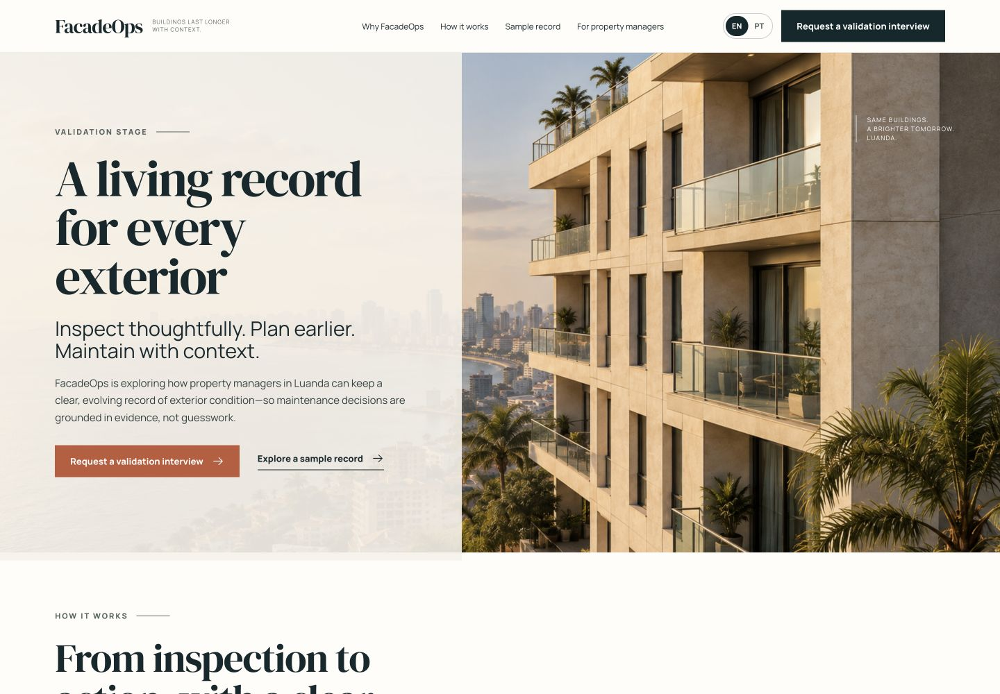

# FacadeOps

> A living exterior-condition record for property managers in Luanda.

**Validation stage** — FacadeOps is not yet operating, licensed, certified or insured as a service provider.



[Português](README.pt.md) · [Explore the synthetic condition record](docs/sample-inspection-report.md) · [Read the service blueprint](docs/service-blueprint.md)

FacadeOps explores a more useful outcome than isolated building photos: a structured, evolving record that connects visual evidence, qualified interpretation, uncertainty and next actions. The first proposed offer is inspection documentation. Cleaning, repair and other field interventions remain partner-delivered possibilities to evaluate only after the relevant operational, regulatory, safety and insurance requirements are verified.

## What is included

- A bilingual, responsive concept site with a working synthetic-record preview.
- A service blueprint that separates property-manager, operator and qualified-review responsibilities.
- A synthetic inspection record and minimum data contract.
- Customer and specialist research guides, survey and 30-day validation plan.
- A risk register and dated source register for publication and operational claims.
- An editable cost and pricing model with clearly marked illustrative assumptions.

## Run the concept site

Requirements: Node.js 20 or newer and npm.

```bash
cd site
npm ci
npm run dev
```

Use `npm run check` for the same production build and hosting-contract tests run in continuous integration.

## Repository guide

| Area | Purpose |
| --- | --- |
| [`site/`](site/) | React/Vite bilingual concept site |
| [`docs/sample-inspection-report.md`](docs/sample-inspection-report.md) | Synthetic deliverable example |
| [`docs/service-blueprint.md`](docs/service-blueprint.md) | Proposed delivery flow and responsibilities |
| [`docs/data-schema.md`](docs/data-schema.md) | Minimum digital-record contract |
| [`docs/validation-plan.md`](docs/validation-plan.md) | Evidence gates for a limited pilot |
| [`docs/risk-register.md`](docs/risk-register.md) | Safety, privacy and publication gates |
| [`research/sources.md`](research/sources.md) | Dated source register |
| [`artifacts/facadeops-pricing-model.xlsx`](artifacts/facadeops-pricing-model.xlsx) | Editable pricing model |

## Claims and privacy boundary

This repository uses synthetic buildings, imagery and findings. It contains no customer addresses, contact data, credentials, flight plans or real inspection evidence. A photograph is not itself a diagnosis, and FacadeOps does not replace structural, engineering or statutory inspection.

See [`LICENSE`](LICENSE) for code and content terms and [`site/public/assets/ASSETS.md`](site/public/assets/ASSETS.md) for visual-asset provenance.
